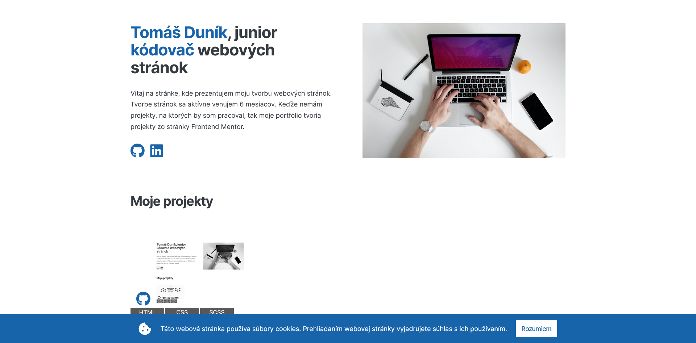

# Moja osobná webová stránka

## 📝 Informácie o projekte

Tento projekt je moja osobná webová stránka. Stránku postupne vylepšujem a upravujem.

## 🛠️ Vytvorené s

- HTML
- CSS
- Sass
- JavaScript

## 🧭 Užitočné odkazy

- Dizajnom stránky som sa inšpiroval na Udemy, v kurze[ Build Responsive Real-World Websites with HTML and CSS](https://www.udemy.com/course/design-and-develop-a-killer-website-with-html5-and-css3/)

- Obrázky na stránke sú stiahnuté z [Unsplash](https://unsplash.com/)

- JavaScriptovový kód pre cookies je upravený od [CodingNepal](https://www.codingnepalweb.com/cookie-consent-box-using-html-css-javascript/)

## 📸 Screenshots

### 💻 Desktop

### 📱 Tablet

### 📱 Mobil

